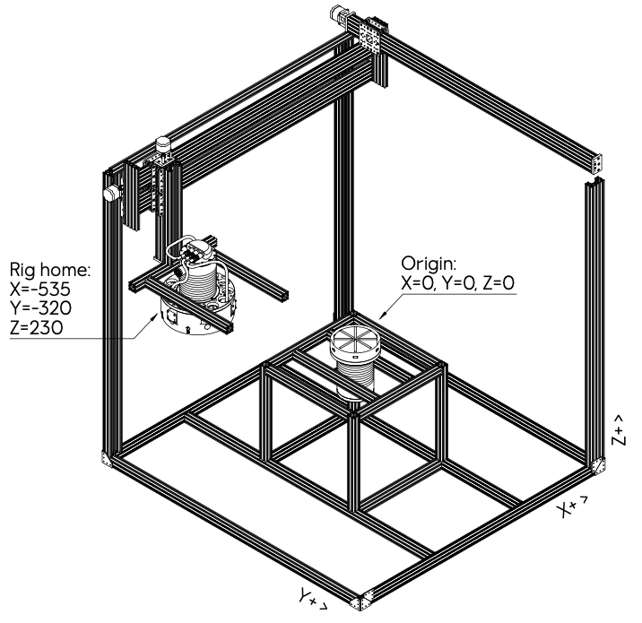

# Magnetic Homing POC - ROS2 Package


## Overview

This is a _proof of concept_ for how one can simulate a subsea drone that home in on the magnetic field from a subsea docking station charge port.  

Main components:
- **CNC rig** - Repurposed to be the simulator where the toolhead is the drone (holds the charge connector) and the plate is the docking station with a charging port
- **Subsea charge connector** - What the drone carry
- **Subsea charge port** - What the docking station provide
- **Computer** - Control the CNC rig and read output from the sensors.  
  Any laptop should work as long as you can connect USB to the CNC and ETH to the sensors. We used a Raspberry 4.

This POC is implemented as a ROS2 package containing two nodes:
1. **Magnetic Sensor Node**: Interacts with magnetic homing sensors to read magnetic strength values dynamically.
2. **CNC Controller Node**: Communicates with a GRBL-based CNC controller (OpenBuilds Blackbox) to control a CNC rig.

Both nodes are implemented in Python for ease of use and compatibility with the end user's experience.

This work builds upon the previous Node.js/Node-RED implementation available in directory [./archived_pre2025_code](./archived_pre2025_code/).  
The current ROS2 implementation adapts the core concepts and protocols from the original project while providing a more modular and robotics-focused framework using ROS2.


**ARCHIVED**  
This repo is intended as a _proof of concept_ for drone vendors and other third parties to be inspired by and/or make it their own for their specific use case. It is _not_ in any way, shape or form production ready code, and will not be maintained.





## Disclaimer

> **IMPORTANT NOTICE**: This code is currently completely untested with actual hardware. It is provided "as is" without warranty of any kind, express or implied. The authors and contributors assume no responsibility or liability for any errors or issues that may arise from its use. 
>
> By using this software, you acknowledge that you are doing so entirely at your own risk. It is the end user's sole responsibility to test thoroughly in a safe environment, ensure proper safety measures are in place, and verify all functionality before any operational use. Particular attention should be paid to the CNC control system, which could cause physical damage to equipment and people if not properly configured or operated.
>
> Please refer to the [CNC Safety Primer](./docs/tutorials/CNC_safety_primer.md) for additional safety considerations.


## Table of Contents

- [Overview](#overview)
- [Docs](./docs/README.md)
- [Disclaimer](#disclaimer)
- [Getting Started Quickly](#getting-started-quickly)
- [Usage](#usage)
- [ROS2 Oveview](#ros2-overview)
- [Future Enhancements](#future-enhancements)


## Getting Started Quickly

**→ [Quick Start Guide](docs/tutorials/quick_start.md)** - Start here for installation instructions, basic setup, and examples of essential operations. This guide covers:
- Prerequisites and installation
- Hardware setup
- Starting the system with launch files
- Verifying operation
- Basic movement and control commands

For more detailed information about the physical setup and sensor arrangement, see the [Physical Setup](./docs/references/physical_setup.md) documentation.


## Usage

### Prerequisites
- A complete ROS2 development environment (we used Jazzy)
- Python 3.8 or higher
- Hardware requirements:
  - Magnetic sensors accessible via Ethernet connection
  - CNC rig with GRBL controller accessible via USB-to-Serial connection

### Installation
1. **Clone the repository** into your ROS2 workspace:
   ```bash
   cd ~/ros2_ws/src
   git clone <repository-url>
   ```

2. **Build the package**:
   ```bash
   cd ~/ros2_ws
   colcon build 
   source install/setup.bash
   ```

### Running the Modules

#### Using the Launch File (Recommended)
Start both nodes with a single command:
```bash
ros2 launch magnetic_homing magnetic_homing.launch.py sensor_ip:=192.168.1.254 serial_port:=/dev/ttyUSB0
```

#### Starting Individual Nodes

1. **Start the Magnetic Sensor Node**:
   ```bash
   ros2 run magnetic_homing magnetic_sensor_node.py --ros-args -p sensor_ip:=192.168.1.254
   ```
   - Use the `/set_sensor_ip` service to reconfigure the sensor's IP address:
     ```bash
     ros2 service call /set_sensor_ip std_srvs/srv/setBool "{data: '192.168.1.254'}"
     ```

2. **Start the CNC Controller Node**:
   ```bash
   ros2 run magnetic_homing cnc_controller_node.py --ros-args -p serial_port:=/dev/ttyUSB0
   ```
   - Use the `/cnc/send_gcode` service to send custom G-code commands:
     ```bash
     ros2 service call /cnc/send_gcode std_srvs/srv/setBool "{data: 'G0 X10 Y10'}"
     ```
   - Use the `/cnc/home` service to home the machine:
     ```bash
     ros2 service call /cnc/home std_srvs/srv/Trigger "{}"
     ```
   - Use the `/cnc/reset` service to reset the GRBL controller:
     ```bash
     ros2 service call /cnc/reset std_srvs/srv/Trigger "{}"
     ```

### Running the Terminal User Interface

Start the terminal gui node to control the system through a terminal-based interface:
```bash
ros2 run magnetic_homing terminal_gui_node
```

The terminal gui provides:
- Real-time display of CNC status and position
- Live magnetic sensor data readings
- GRBL response monitoring
- Menu-driven access to all CNC control functions:
  - Basic operations (Home, Reset, Emergency Stop)
  - Movement control (Absolute/Relative modes)
  - Target positioning commands
  - Custom G-code input
  - Feed rate control
  - Jogging functionality

Navigate using the numbered menu options. Some commands may prompt for additional input (like G-code or feed rate values). Press 'Q' to quit the interface.

> **Note**: The terminal gui node requires a terminal that supports curses and should be run in a full-size terminal window for optimal display.


### Example Workflow
- Start both nodes using the launch file.
- Monitor sensor data on the `/magnetic_sensor_data` topic:
  ```bash
  ros2 topic echo /magnetic_sensor_data
  ```
- Monitor CNC status on the `/cnc/status` topic:
  ```bash
  ros2 topic echo /cnc/status
  ```
- Monitor CNC position on the `/cnc/position` topic:
  ```bash
  ros2 topic echo /cnc/position
  ```
- Send a homing command to initialize the CNC rig:
  ```bash
  ros2 service call /cnc/home std_srvs/srv/Trigger "{}"
  ```
- Switch to absolute positioning mode:
  ```bash
  ros2 service call /cnc/set_absolute_mode std_srvs/srv/Trigger "{}"
  ```
- Set feed rate to 500 mm/min:
  ```bash
  ros2 service call /cnc/set_feed_rate std_srvs/srv/setBool "{data: '500'}"
  ```
- Send G-code commands to move the CNC rig to a specific position (in absolute mode):
  ```bash
  ros2 service call /cnc/send_gcode std_srvs/srv/setBool "{data: 'G0 X10 Y10'}"
  ```
- Switch to relative positioning mode:
  ```bash
  ros2 service call /cnc/set_relative_mode std_srvs/srv/Trigger "{}"
  ```
- Send G-code commands to move the CNC rig relative to current position:
  ```bash
  ros2 service call /cnc/send_gcode std_srvs/srv/setBool "{data: 'G0 X5 Y-3'}"
  ```


## ROS2 Overview

Version: [Jazzy](https://docs.ros.org/en/jazzy/)

### Magnetic Sensor Node

#### Features
- **Initialization**: Configure the IP address and initialize the sensors.
- **Data Reading**: Continuously read magnetic strength values from sensors A, B, C, and Z.
- **ROS2 Integration**:
  - Publishes sensor data to a topic (e.g., `/magnetic_sensor_data`).
  - Provides a service to reconfigure the IP address dynamically.

#### ROS2 Topics and Services
- **Topic**: `/magnetic_sensor_data`
  - **Message Type**: `MagneticSensorData.msg`
  - **Fields**: `float32 sensor_a`, `float32 sensor_b`, `float32 sensor_c`, `float32 sensor_z`
- **Service**: `/set_sensor_ip`
  - **Service Type**: `std_srvs/setBool`
  - **Request**: `string data` (containing the IP address)
  - **Response**: `bool success, string message`

### CNC Controller Node

> **IMPORTANT**: Please refer to the [CNC Safety Primer](docs/tutorials/CNC_safety_primer.md) document before operating the CNC controller. It contains critical safety information, including the risk of mechanical collisions at extreme positions.

#### Features
- **Initialization**: Configure the serial port and home the CNC rig.
- **Dynamic Control**: Move the CNC rig based on sensor data and user-defined logic.
- **ROS2 Integration**:
  - Subscribes to sensor data from the Magnetic Sensor Node.
  - Provides a service to send custom G-code commands.

#### ROS2 Topics and Services
- **Topics**:
  - `/cnc/status` - JSON-formatted status information
    - **Message Type**: `std_msgs/String`
    - **Fields**: Machine state and position information in JSON format
  - `/cnc/position` - Current position of the CNC machine
    - **Message Type**: `std_msgs/Float32MultiArray`
    - **Fields**: Array with [x, y, z] position values
  - `/cnc/response` - Command responses from GRBL
    - **Message Type**: `std_msgs/String`
    - **Fields**: Raw response messages from the GRBL controller
- **Services**:
  - `/cnc/send_gcode` - Send G-code commands to the CNC controller
    - **Service Type**: `std_srvs/setBool`
    - **Request**: `string data` (containing the G-code command)
    - **Response**: `bool success, string message`
  - `/cnc/home` - Execute the homing procedure
    - **Service Type**: `std_srvs/Trigger`
    - **Request**: (empty)
    - **Response**: `bool success, string message`
  - `/cnc/reset` - Reset the GRBL controller
    - **Service Type**: `std_srvs/Trigger`
    - **Request**: (empty)
    - **Response**: `bool success, string message`
  - `/cnc/set_absolute_mode` - Switch to absolute positioning mode (G90)
    - **Service Type**: `std_srvs/Trigger`
    - **Request**: (empty)
    - **Response**: `bool success, string message`
  - `/cnc/set_relative_mode` - Switch to relative positioning mode (G91)
    - **Service Type**: `std_srvs/Trigger`
    - **Request**: (empty)
    - **Response**: `bool success, string message`
  - `/cnc/set_feed_rate` - Set the feed rate for movements
    - **Service Type**: `std_srvs/setBool`
    - **Request**: `string data` (containing the feed rate)
    - **Response**: `bool success, string message`


## Future Enhancements
- Add visualization tools (e.g., RViz) to display sensor data and CNC rig movements.
- Implement advanced control algorithms for CNC rig movement based on sensor data.
