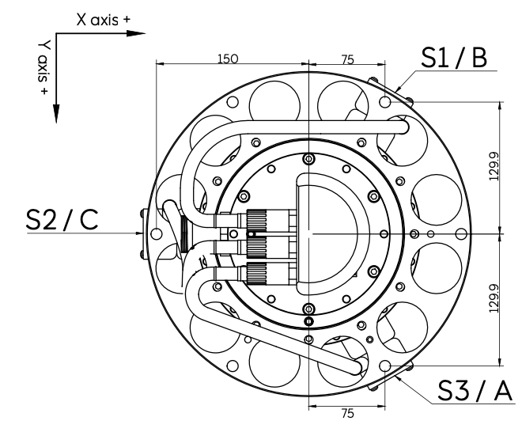
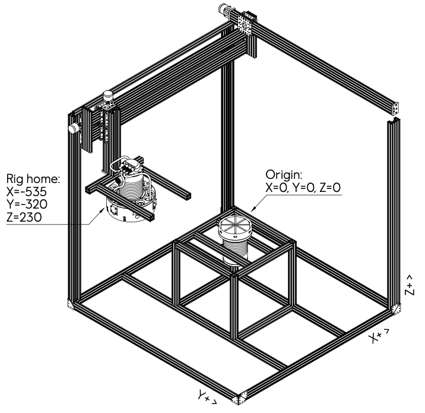

# Physical Setup and Sensor Configuration

This document describes the physical setup of the CNC rig, the magnetic sensors, and the inductive charging system that this package is designed to work with.

## System Overview

The Magnetic Homing system is designed to precisely position an inductive charging receiver (secondary side) directly above an inductive charging transmitter (primary side) using magnetic field sensors for alignment. This setup enables efficient wireless power transfer by ensuring optimal alignment between the charging coils.

## CNC Rig Configuration

The CNC rig serves as a testbed for the magnetic homing system:

- The **primary inductive charger** (transmitter) is fixed at the center of the X and Y axes at the highest Z position (approximately Z=230)
- The **secondary inductive charger** (receiver) is mounted on the CNC's mobile platform and can move along the X, Y, and Z axes
- The receiver is equipped with three magnetic sensors and a charging power strenght sensor that provide data for alignment

## Sensor Arrangement

The secondary charging coil has three magnetic sensors arranged as follows:

1. **Three Alignment Sensors (A, B, C)** are positioned around the secondary charging coil with 120-degree spacing:
   - All sensors point downward toward the primary charging coil
   - When all three sensors read equal/similar values, the secondary coil is directly above the primary coil
   - These sensors primarily detect lateral (X-Y plane) alignment

2. **Z-Axis Sensor** is a separate charging power strength sensor that can indirectly indicate the vertical distance between the charging coils:
   - At large distances (over 30-40cm), the Z sensor reading is close to or at zero
   - The reading increases as the coils get closer to each other
   - The Z sensor operates on a different measurement principle than sensors A, B, and C
   - It provides critical data for vertical positioning and "landing"

## Sensor Orientation on the Secondary Coil

The three alignment sensors (A, B, C) are positioned on the secondary coil as follows:

- **Sensor C (S2)** points toward the lowest X-axis value (0)
- **Sensor B (S1)** points toward the lowest Y-axis value possible
- **Sensor A (S4)** points toward the highest Y-axis value possible

This arrangement ensures optimal detection of misalignment in any direction in the X-Y plane.

## Coordinate System

The coordinate system used in this project is defined as:

- The **origin (0,0,0)** is at the center of the primary charging coil
- **X and Y axes** represent horizontal movement in the plane parallel to the charging surfaces
- **Z axis** represents vertical distance between the charging coils
- Positive Z values indicate greater distance between coils

Note that in the original Node-RED implementation, some axis values could show negative values when closer to the homing position. This was done to make it easier for human operators to relate to the primary side placement. The document "UTF-8Overview of mapping rig and sensors.pdf" provides a visual representation of this coordinate system.

## Autonomous Positioning Approach

The autonomous positioning process follows these general steps:

1. **Coarse Alignment Phase**:
   - The controller moves toward the sensor with the strongest reading (A, B, or C)
   - Movement uses fixed speeds/angles/distances until all three sensor values approach equality
   - Sensor noise and jitter are filtered to stabilize readings

2. **Fine Alignment Phase**:
   - When all three alignment sensors (A, B, C) read approximately equal values, the secondary coil is directly above the primary coil in the X-Y plane
   - The controller then begins vertical descent while making periodic lateral adjustments to maintain equality of the A, B, C sensor values

3. **"Landing" Phase**:
   - Descent continues until the Z sensor value rises above a threshold (approximately 36,000 on a full strenght primary coil)
   - When this threshold is reached while maintaining A, B, C sensor equality, the secondary coil is properly aligned with the primary coil both laterally and vertically
   - The final "landing" (bringing the coils into optimal charging distance) can then be performed with a gentle downward movement. This last step should however NOT be performed on the test righ where the primary and secondary sides can PHYSICALLY crash with force into each other if so is done!

This "helicopter-style" landing approach (vertical descent after X-Y alignment) ensures accurate positioning, as a diagonal approach could produce confusing or misleading sensor readings.

## Visual Reference

For a visual overview of the test rig and sensor placement, refer to the document [Overview of mapping rig and sensors.pdf](Overview%20of%20mapping%20rig%20and%20sensors.pdf) in the references directory.
