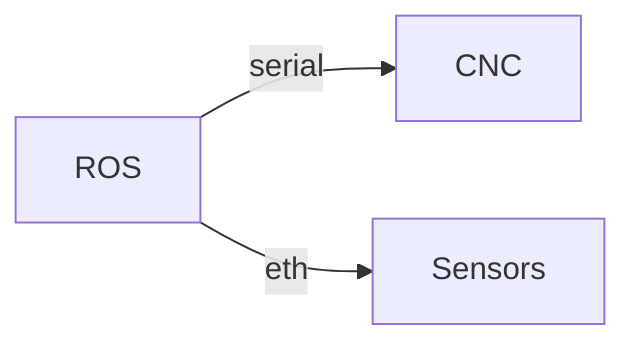
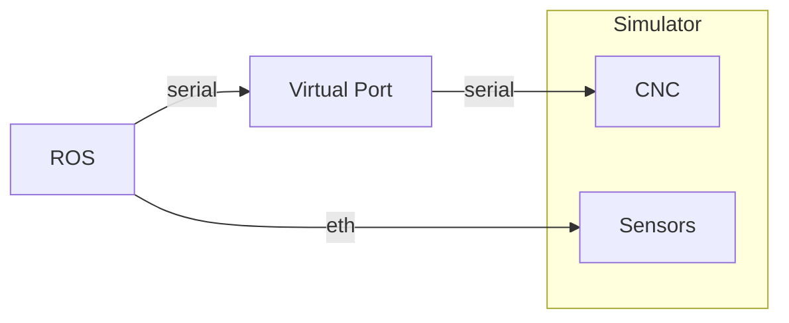
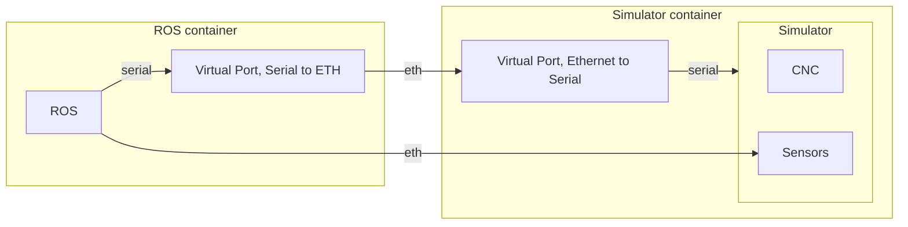

# Simulator for Magnetic Homing

A simple simulator for communicating with the CNC and the magnetic sensors.

Real World:

```mermaid
graph LR
ros[ROS] -- serial --> cnc[CNC]
ros[ROS] -- eth --> sensors[Sensors] 
```

Simulation (Local):

```mermaid
graph LR
ros[ROS] -- serial --> virtual-port[Virtual Port] -- serial --> cnc[CNC]
ros[ROS] -- eth --> sensors[Sensors]

subgraph simulator[Simulator]
    cnc[CNC]
    sensors[Sensors]
end
```

Simulation (Docker):

```mermaid
graph LR

subgraph ros-container[ROS container]
ros[ROS] -- serial --> virtual-port-ros[Virtual Port, Serial to ETH]
end

subgraph simulator-container[Simulator container]
virtual-port-simulator[Virtual Port Ethernet to Serial] -- serial --> simulator[Simulator]
end

subgraph simulator[Simulator]
    cnc[CNC]
    sensors[Sensors]
end

virtual-port-ros[Virtual Port, Serial to ETH] -- eth --> virtual-port-simulator[Virtual Port, Ethernet to Serial]
ros[ROS] -- eth --> sensors[Sensors]
```